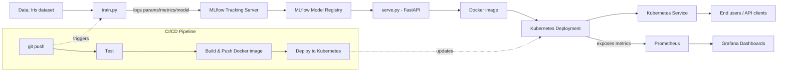

# MLOps Platform for AI Deployment

Internship project — **ITGate Group**, Summer 2026
Subject 2: *Plateforme MLOps pour déploiement IA*

## Goal

Design and build a platform that handles the full lifecycle of a Machine Learning model:
**training → experiment tracking → containerization → orchestrated deployment → CI/CD automation → monitoring.**

The focus of this project is the **platform and automation around the model**, not the sophistication of the model itself.

## Use case

A simple classification model trained on the classic **Iris dataset** (predicting flower species from petal/sepal measurements). This dataset is intentionally simple and fast to train — it exists only to exercise the MLOps pipeline end to end.

## Tech stack

| Layer | Tool |
|---|---|
| Model training & experiment tracking | MLflow |
| Model serving | FastAPI |
| Containerization | Docker |
| Orchestration | Kubernetes |
| CI/CD | GitHub Actions |
| Monitoring & dashboards | Prometheus + Grafana |

## Architecture



**Flow summary:**
1. `train.py` trains the model on the Iris dataset and logs parameters, metrics, and the model artifact to **MLflow**.
2. The best model is promoted in the **MLflow Model Registry**.
3. `serve.py` (FastAPI) loads the registered model and exposes a `/predict` REST endpoint.
4. The API is containerized with **Docker** and deployed on **Kubernetes** (Deployment + Service, with health checks).
5. A **CI/CD pipeline** (GitHub Actions) automates: run tests → build & push the Docker image → deploy to Kubernetes on every push.
6. **Prometheus** scrapes metrics from the running API/cluster, and **Grafana** visualizes them (request volume, latency, error rate, pod health).

## Project structure

```
mlops-platform/
├── data/                   # dataset (or dataset-fetch script)
├── src/
│   ├── train.py            # training + MLflow tracking
│   └── serve.py            # FastAPI serving the model
├── docker/
│   ├── Dockerfile.train
│   └── Dockerfile.serve
├── k8s/
│   ├── deployment.yaml
│   └── service.yaml
├── .github/workflows/
│   └── mlops.yml           # CI/CD pipeline
├── requirements.txt
├── journal.md              # daily progress reports
└── README.md
```

## Status

- [x] Day 1 — Project setup & scoping
- [ ] Day 2 — Project structure & Python environment
- [ ] Day 3 — Model training script
- [ ] Day 4 — MLflow Tracking integration
- [ ] Day 5 — Dockerize training
- [ ] Week 2 — Containerization & Kubernetes
- [ ] Week 3 — CI/CD
- [ ] Week 4 — Monitoring & finalization

## Author

Intern @ ITGate Group — Summer 2026 internship program
