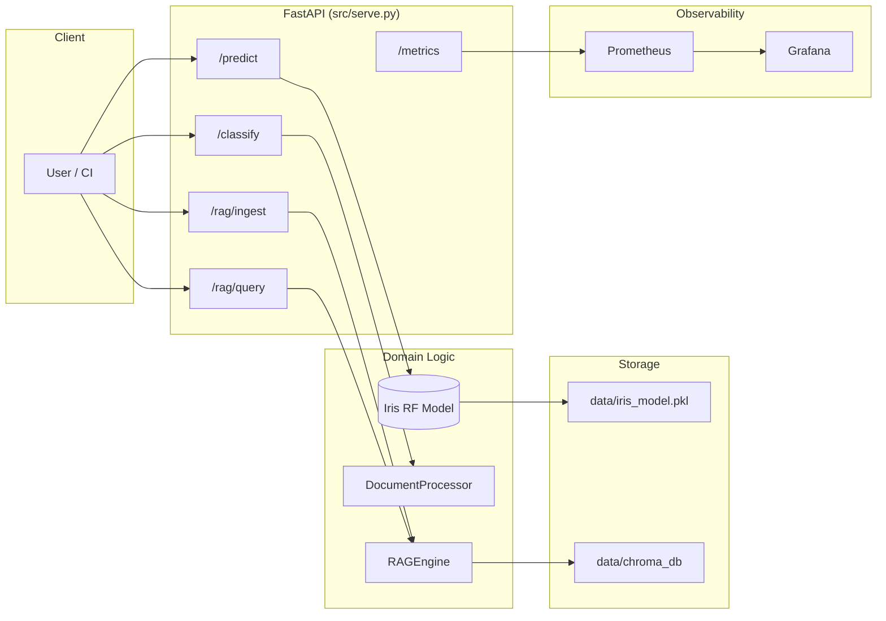

# MLOps Platform — Final Progress Report

**Project:** Sujet 2 — Plateforme MLOps pour déploiement IA  
**Organization:** ITGate Group — Summer 2026 Internship  
**Primary ML use case:** Iris classification (baseline pipeline validation)  
**Extended AI capabilities:** Document classification, metadata extraction, and RAG retrieval

---

## Executive summary

This repository delivers a production-oriented MLOps platform that automates the full machine learning lifecycle:

**Train → Track → Register → Serve → Containerize → Orchestrate → CI/CD → Monitor**

Beyond the Iris baseline, the platform now includes a complete **Document AI** and **RAG (Retrieval-Augmented Generation)** pipeline integrated into the same FastAPI serving layer, with Prometheus observability and Docker Compose orchestration.

| Capability | Status |
|------------|--------|
| Training + MLflow tracking | ✅ Complete |
| FastAPI serving (`/predict`) | ✅ Complete |
| Document classification + extraction (`/classify`) | ✅ Complete |
| RAG ingestion + semantic search (`/rag/*`) | ✅ Complete |
| Prometheus + Grafana monitoring | ✅ Complete |
| Docker + Kubernetes deployment | ✅ Complete |
| GitHub Actions CI/CD | ✅ Complete |
| Unit test suite (`pytest -q`) | ✅ 13 tests passing |

---

## Architecture overview



---

## Week 1 — Foundations ✅

### Training pipeline (`src/train.py`)
- Dataset: `sklearn.datasets.load_iris`
- Split: 80/20 stratified, `random_state=42`
- Model: `RandomForestClassifier`
- Metrics: accuracy, F1-weighted, confusion matrix, classification report
- Local export: `--local-model-path data/iris_model.pkl`
- MLflow: params, metrics, artifacts, optional Model Registry

### Experiment sweeps
- `scripts/run_experiments.ps1` / `.sh` — 4 hyperparameter runs

---

## Week 2 — Containerization & Kubernetes ✅

### Serving container (`docker/Dockerfile.serve`)
- **Multi-stage build:** trains Iris model during image build, then serves it
- **Pre-downloads** `all-MiniLM-L6-v2` embedding weights at build time
- Creates persistent directories: `data/chroma_db`, `data/processed`, etc.
- Environment: `MODEL_LOCAL_PATH`, `CHROMA_DB_PATH`
- Docker `HEALTHCHECK` on `/health`

### Local stack (`docker-compose.yml`)
| Service | Port | Role |
|---------|------|------|
| `api` | 8000 | FastAPI + ML + Document AI + RAG |
| `prometheus` | 9090 | Scrapes `/metrics` |
| `grafana` | 3000 | Dashboards (admin/admin) |

**Volumes:** `./data/chroma_db` and `./data/processed` are mounted for persistence across restarts.

### Kubernetes (`k8s/`)
Namespace, ConfigMap, Secret, Deployment (2 replicas), Service, Ingress, HPA (2–5 pods).

---

## Week 3 — CI/CD ✅

**File:** `.github/workflows/mlops.yml`

```
test (flake8 + pytest)
   ↓
train (Iris model artifact)
   ↓
build (Docker images → GHCR)
   ↓
deploy (Kubernetes, optional)
```

---

## Week 4 — Monitoring ✅

### Prometheus metrics (`src/metrics.py` + middleware in `src/serve.py`)

| Metric | Type | Labels | Description |
|--------|------|--------|-------------|
| `mlops_predictions_total` | Counter | `model_type`, `status` | Inference operations |
| `mlops_http_requests_total` | Counter | `endpoint`, `status` | All HTTP traffic |
| `mlops_prediction_latency_seconds` | Histogram | `endpoint` | Per-route latency |

**Tracked endpoints:** `/predict`, `/classify`, `/rag/ingest`, `/rag/query`, `/health`, `/metrics`

**Prediction counter `model_type` values:**
- `iris`
- `document_classification`
- `rag_ingest`
- `rag_query`

---

## Document AI pipeline (`src/classifier.py`)

### DocumentProcessor

| Method | Purpose |
|--------|---------|
| `classify(text)` | Keyword-scoring classification into Invoice / Contract / Report |
| `extract_information(text)` | Regex-based extraction of emails, dates, amounts |
| `process(text)` | Combined classification + extraction |

### Classification logic
Rule-based keyword scoring across three categories (English + French keywords). Returns category, confidence, and per-category scores.

### Extraction patterns
| Field | Pattern |
|-------|---------|
| Emails | Standard RFC-like email regex |
| Dates | `DD/MM/YYYY`, `YYYY-MM-DD`, `Month DD, YYYY` |
| Amounts | Currency-prefixed or suffixed values (`$`, `€`, `USD`, `EUR`, `TND`) |

---

## RAG pipeline (`src/rag.py`)

### RAGEngine

| Component | Implementation |
|-----------|----------------|
| Vector store | ChromaDB `PersistentClient` |
| Embeddings | `sentence-transformers/all-MiniLM-L6-v2` |
| Collection | `document_knowledgebase` (configurable) |
| Persistence | `data/chroma_db/` (env: `CHROMA_DB_PATH`) |
| Ingestion | `upsert` by `doc_id` (idempotent re-ingest) |
| Query | Semantic top-k retrieval with distances |

### Environment variables
| Variable | Default | Description |
|----------|---------|-------------|
| `CHROMA_DB_PATH` | `./data/chroma_db` | ChromaDB storage directory |
| `CHROMA_COLLECTION_NAME` | `document_knowledgebase` | Collection name |
| `EMBEDDING_MODEL` | `all-MiniLM-L6-v2` | Sentence-transformers model |

---

## API reference (`src/serve.py`)

| Method | Path | Request body | Response |
|--------|------|--------------|----------|
| GET | `/` | — | Service metadata |
| GET | `/health` | — | `{status, model_loaded, rag_engine}` |
| GET | `/metrics` | — | Prometheus text format |
| POST | `/predict` | `{features: [[float×4], ...]}` | `{predictions: [int]}` |
| POST | `/classify` | `{text: str}` | `{classification, extraction}` |
| POST | `/rag/ingest` | `{doc_id, text, metadata?}` | `{status, doc_id}` |
| POST | `/rag/query` | `{query, top_k?}` | `{query, retrieved_context, metadata, distances, collection_size}` |

Interactive docs: **http://localhost:8000/docs**

### Example requests

**Classify an invoice:**
```bash
curl -X POST http://localhost:8000/classify \
  -H "Content-Type: application/json" \
  -d '{"text": "INVOICE #42. Total due: $500. Contact billing@acme.com. Date: 08/10/2026."}'
```

**Ingest + query RAG:**
```bash
curl -X POST http://localhost:8000/rag/ingest \
  -H "Content-Type: application/json" \
  -d '{"doc_id": "doc-1", "text": "MLflow tracks experiments and model versions.", "metadata": {"source": "manual"}}'

curl -X POST http://localhost:8000/rag/query \
  -H "Content-Type: application/json" \
  -d '{"query": "How are experiments tracked?", "top_k": 2}'
```

---

## Test coverage

| File | Tests | Coverage |
|------|-------|----------|
| `tests/test_train.py` | 2 | Training script, serve import |
| `tests/test_classifier.py` | 3 | Classification + extraction unit tests |
| `tests/test_serve.py` | 8 | All API routes + Prometheus metrics |
| `tests/conftest.py` | — | Session-scoped model + RAG fixtures |

```powershell
pytest -q
# 13 passed
```

**Design notes for test stability:**
- Prometheus metrics extracted to `src/metrics.py` (avoids duplicate registration on reload)
- Session-scoped `RAGEngine` fixture (embedding model loaded once)
- Iris model injected directly (no module reload)

---

## How to run the full platform

```powershell
# 1. Install dependencies
pip install -r requirements.txt

# 2. Train Iris model locally
python src/train.py --local-model-path data/iris_model.pkl

# 3. Serve locally
$env:MODEL_LOCAL_PATH="data/iris_model.pkl"
$env:CHROMA_DB_PATH="data/chroma_db"
uvicorn src.serve:app --port 8000

# 4. Full stack with monitoring
docker compose up --build

# 5. Run tests
pytest -q

# 6. Kubernetes (cluster required)
kubectl apply -f k8s/
```

| Service | URL |
|---------|-----|
| API + Swagger | http://localhost:8000/docs |
| Prometheus | http://localhost:9090 |
| Grafana | http://localhost:3000 (admin/admin) |
| MLflow UI | `mlflow ui --port 5000` |

---

## Repository structure (final)

```
mlops-platform/
├── data/
│   ├── chroma_db/          # ChromaDB persistence (RAG)
│   ├── processed/
│   ├── raw/
│   └── iris_model.pkl        # Local trained model (optional)
├── src/
│   ├── train.py              # Training + MLflow
│   ├── serve.py              # FastAPI gateway (4 core routes)
│   ├── classifier.py         # Document AI
│   ├── rag.py                # RAG engine (ChromaDB + embeddings)
│   └── metrics.py            # Prometheus metrics
├── docker/
│   ├── Dockerfile.train
│   └── Dockerfile.serve      # Multi-stage: train + serve + embed model
├── k8s/                      # Full Kubernetes stack
├── monitoring/               # Prometheus + Grafana
├── scripts/                  # Experiment sweeps
├── tests/
│   ├── conftest.py
│   ├── test_train.py
│   ├── test_serve.py
│   └── test_classifier.py
├── docker-compose.yml
├── .github/workflows/mlops.yml
├── REPORT.md
├── journal.md
└── README.md
```

---

## Compliance with Sujet 2 specifications

| Requirement | Implementation |
|-------------|----------------|
| End-to-end MLOps lifecycle | Train → MLflow → Docker → K8s → CI/CD → Monitor |
| Model serving API | FastAPI with `/predict` |
| Document classification | `/classify` — Invoice / Contract / Report |
| Intelligent data extraction | Regex extraction of emails, dates, amounts |
| RAG with vector search | ChromaDB + `all-MiniLM-L6-v2` via `/rag/ingest` and `/rag/query` |
| Observability | Prometheus counters/histograms + Grafana dashboard |
| Container orchestration | Docker Compose + Kubernetes manifests |
| Automated quality gates | GitHub Actions: lint + pytest + build |

---

## Optional future extensions

These are not required for the current deliverable but would strengthen a production deployment:

- Transformer-based document classification (e.g. DistilBERT fine-tuned)
- LLM answer generation on top of retrieved RAG context (LangChain chains)
- PostgreSQL for structured document metadata
- In-cluster MLflow tracking server
- Vault / Sealed Secrets for production credential management

---

*Report updated: August 10, 2026 — Document AI & RAG integration complete*
